# Code-Challenge-01-JS-Fundamentals

## Objects
An object is a list of properties that have keys and values. 
### Basics 
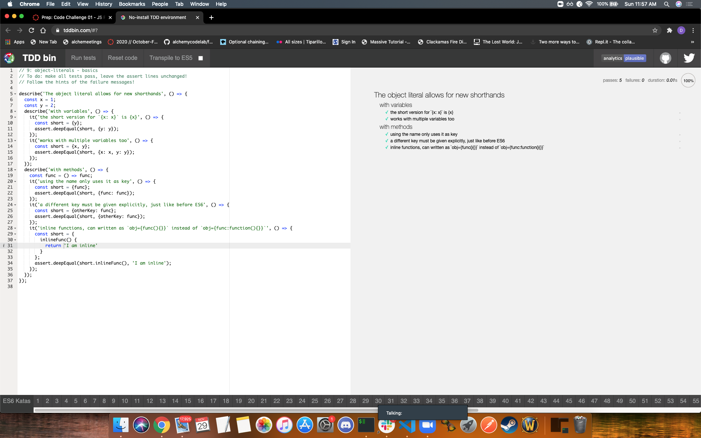
### Computed Properties 
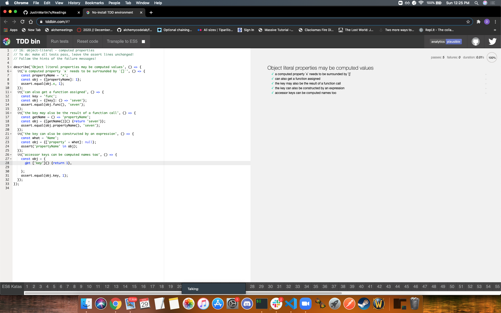

## Classes
You can use classes as a template to make objects. Classes are built on protoypes. Classes like functions and can be define function expressions and function declarations.
### Creation
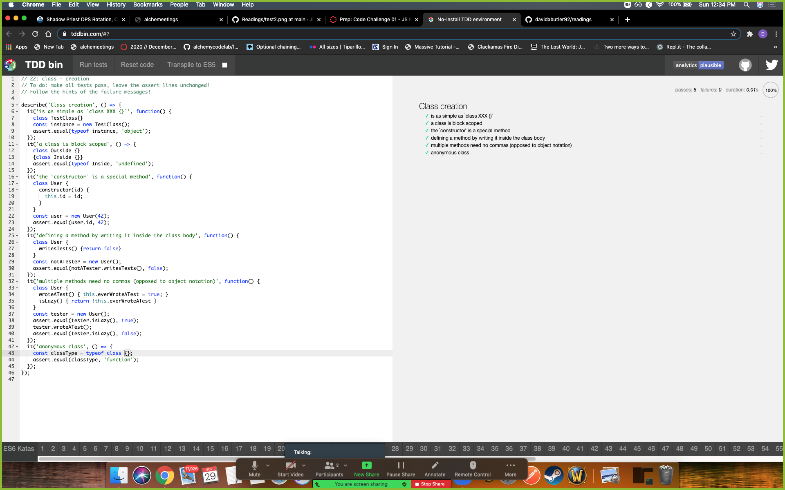
### Statics
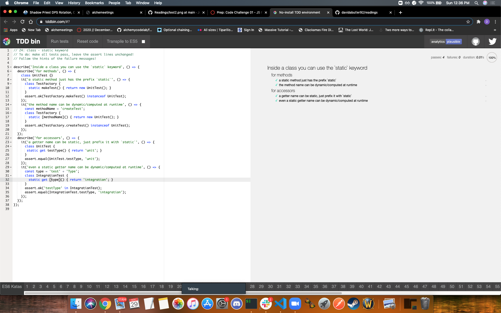
### Extends
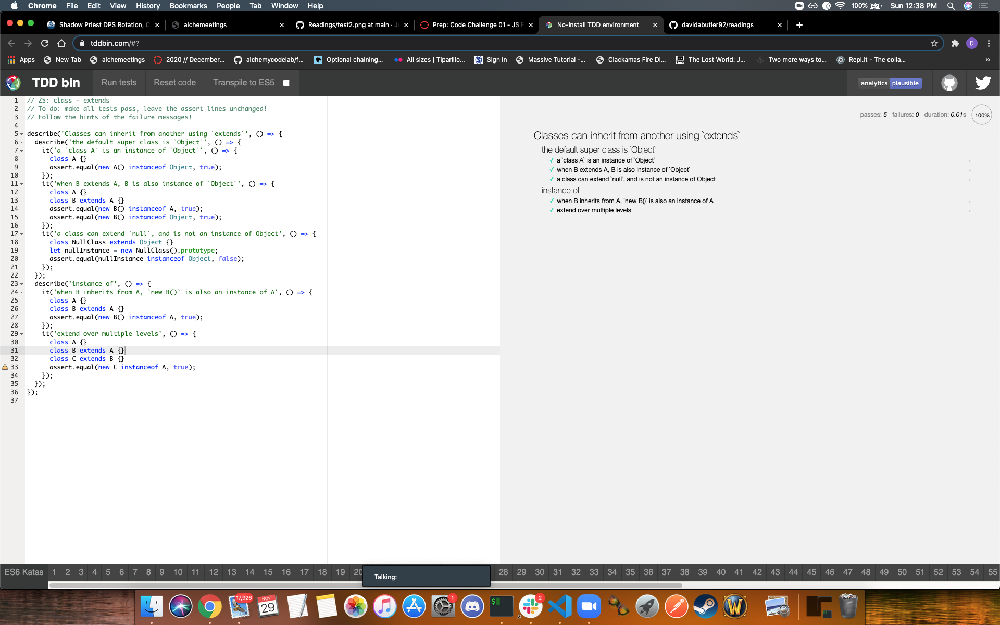

## Destructuring
Desctructuring objects allows you to access the properties as variables
### Array Destructuring
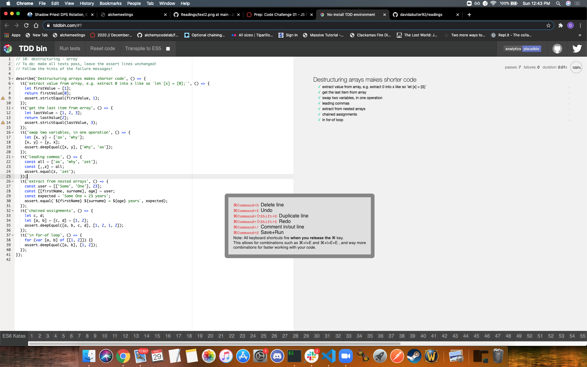
### String Destructuring
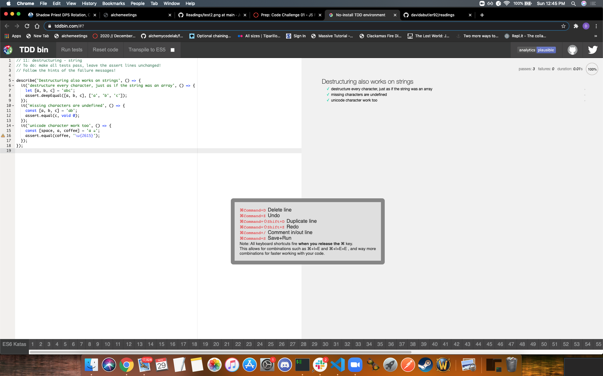
### Object Destructuring
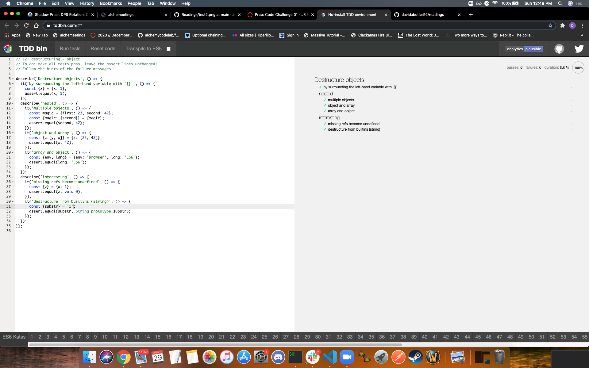
## Destructuring With Defaults
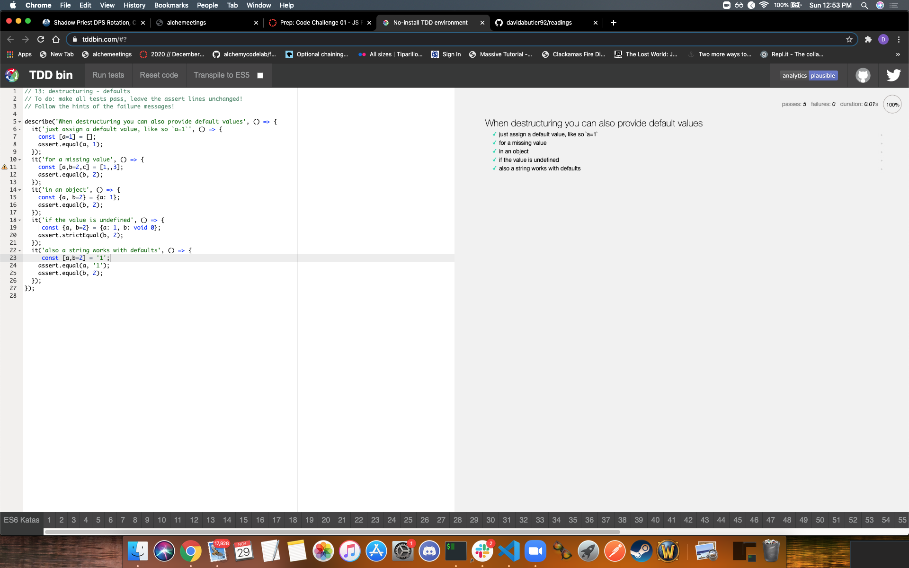
### Destructuring Function Parameters
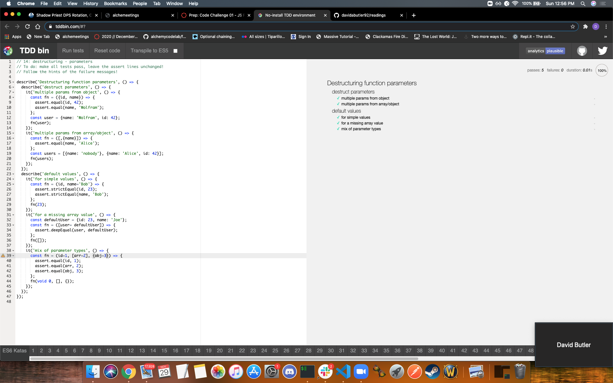
### Destructuring with Alias
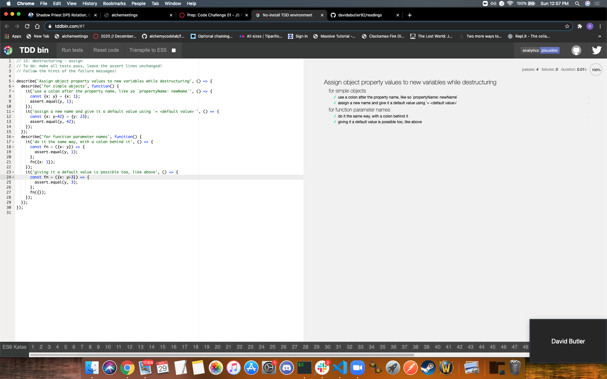

## Rest
Rest stands for REpresentational State Transfer and a rest server provides access to resources and a rest client accesses resources using HTTP.
### Rest as a Parameter
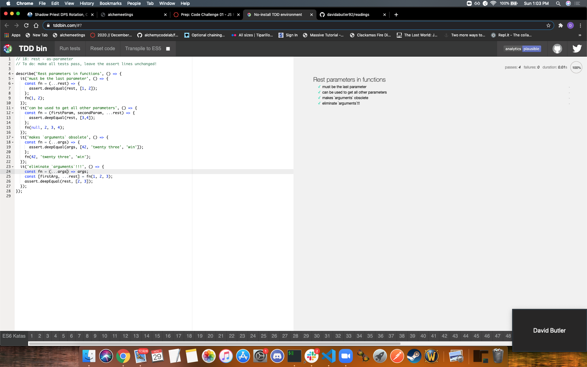
### Rest While Destructuring
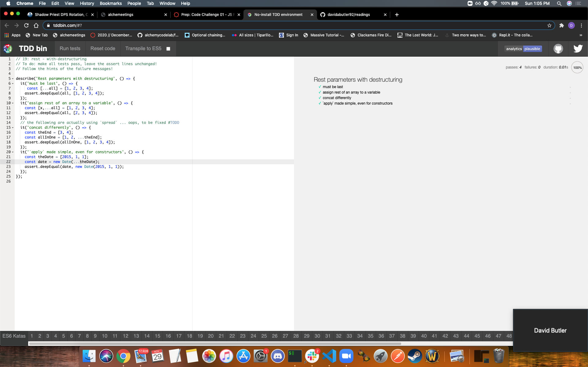

## Spread
Spread operator allows an iterable to expand in places where 0+ arguments are expected 
### Array Spread
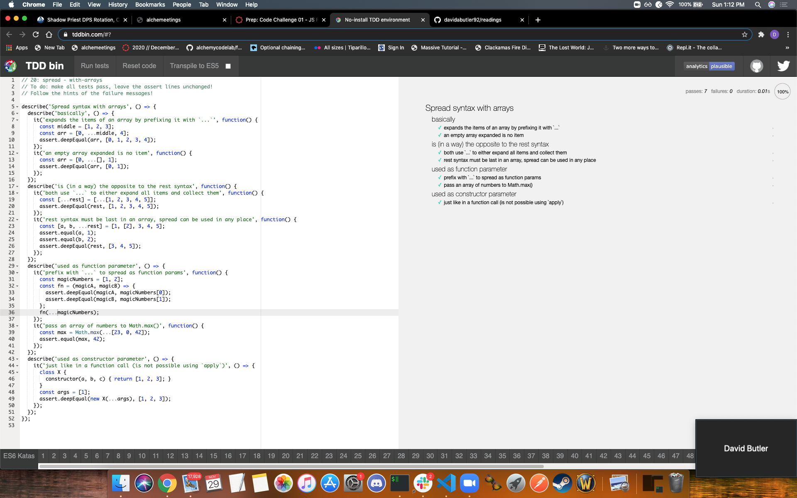

## Function Defaults 
this allows functions to be used with default values if no value is passed or an undefined value is passed. 
### Function Defaults
![] (./screenshots/test15.png)